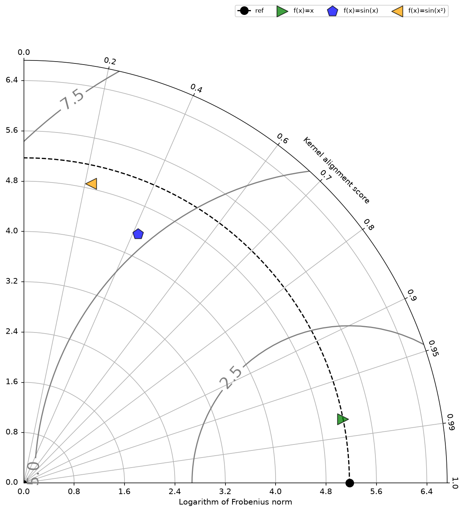

# The Kernelized Taylor Diagram

[](https://github.com/Wickstrom/KernelizedTaylorDiagram/actions/workflows/ci.yml)

This repository contains a Python implementation of the **kernelized Taylor diagram**, a
graphical framework for visualizing similarities between data populations, introduced in:

> Wickstrøm, K., Johnson, J. E., Løkse, S., Camps-Valls, G., Mikalsen, K. Ø.,
> Kampffmeyer, M., & Jenssen, R. (2022).
> *The Kernelized Taylor Diagram*.
> In *Nordic Artificial Intelligence Research and Development* (pp. 125–131).
> Springer. https://doi.org/10.1007/978-3-031-17030-0_10
> (preprint: https://arxiv.org/abs/2205.08864)

The kernelized Taylor diagram relates the **maximum mean discrepancy** and the **kernel
mean embedding** in a single diagram: each data population is represented by a point whose
radius is the (logarithm of the) Frobenius norm of its kernel matrix and whose angle is the
kernel alignment (CKA) score with respect to a reference population. Unlike the classical
Taylor diagram, it captures non-linear relationships and makes minimal assumptions about
the data distributions.



## Installation

```bash
git clone https://github.com/Wickstrom/KernelizedTaylorDiagram.git
cd KernelizedTaylorDiagram
pip install -e .
```

Requires Python 3.10+ with `numpy`, `scipy`, `scikit-learn`, and `matplotlib`.

## Quickstart

```python
import matplotlib.pyplot as plt
import numpy as np
from ktd import HSIC, TaylorDiagram

# reference and comparison populations
np.random.seed(1)
x = np.random.uniform(0, np.pi, size=(500, 1))
z = np.sin(x) + np.random.normal(0, 0.1, size=x.shape)

# kernel alignment score (angle) and kernel norm (radius)
clf = HSIC(center=True, kernel="rbf", gamma_X=1.0, gamma_Y=1.0)
clf.fit(x, x)
ref_norm = np.log(clf.K_x_norm)

clf = HSIC(center=True, kernel="rbf", gamma_X=1.0, gamma_Y=1.0)
clf.fit(x, z)
score = clf.score(normalize=True)
z_norm = np.log(clf.K_y_norm)

# plot
fig = plt.figure(figsize=(10, 10))
td = TaylorDiagram(ref_point=ref_norm, fig=fig, ref_range=(0, 30))
td.add_reference_point(ref_norm, color="black", marker=".", label="ref")
td.add_scatter([z_norm], [score], c="blue", s=200, marker="p", label="sin(x)")
```

For a complete walkthrough — including progressively more complex transformations — see
the example notebook: [`notebooks/example.ipynb`](notebooks/example.ipynb). Running it
regenerates `figures/example.png`.

## Repository layout

```
ktd/                    the package
├── kernels.py          kernel bandwidth (sigma/gamma) estimation
├── hsic.py             Hilbert-Schmidt Independence Criterion (HSIC/CKA)
└── taylor.py           Taylor diagram plotting
notebooks/              example notebook
tests/                  pytest suite
```

The `HSIC` implementation and the bandwidth estimation utilities are adapted from the
[PySim](https://github.com/jejjohnson/pysim) package by J. Emmanuel Johnson, and the
diagram plotting is based on [Yannick Copin's Taylor diagram
implementation](https://gist.github.com/ycopin/3342888).

## Development

Run the test suite with:

```bash
pip install -e ".[dev]"
pytest
```

The example notebook is executed as part of CI to ensure it stays reproducible.

## Citation

If you use this code, please cite the paper (see also [`CITATION.cff`](CITATION.cff)):

```bibtex
@inbook{wickstrom2022kernelized,
  title     = {The Kernelized Taylor Diagram},
  author    = {Wickstr{\o}m, Kristoffer and Johnson, J. Emmanuel and L{\o}kse, Sigurd and
               Camps-Valls, Gustau and Mikalsen, Karl {\O}yvind and Kampffmeyer, Michael and
               Jenssen, Robert},
  booktitle = {Nordic Artificial Intelligence Research and Development},
  series    = {Communications in Computer and Information Science},
  publisher = {Springer International Publishing},
  year      = {2022},
  pages     = {125--131},
  doi       = {10.1007/978-3-031-17030-0_10}
}
```

A preprint is also available on [arXiv:2205.08864](https://arxiv.org/abs/2205.08864).

## License

MIT — see [`LICENSE`](LICENSE).
